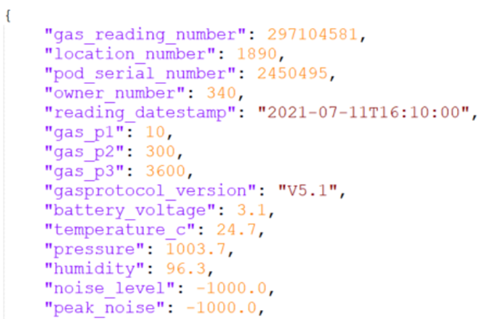
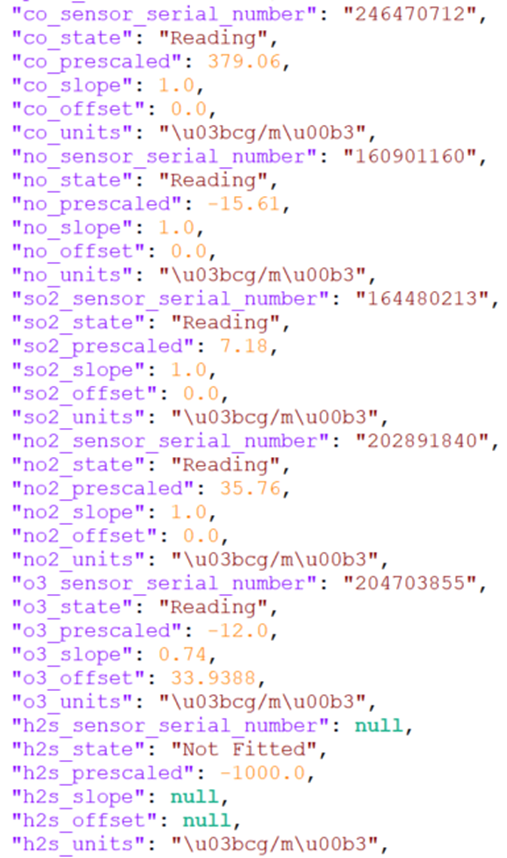

# AQMesh input agent

This agent is for maintaining data and the corresponding instances in the knowledge graph (KG). 
It's only purpose is to retrieve new data (if available) from the API and download it into the corresponding database,
as well as, instantiating KG instances and connection when called for the first time.

The agent uses the [time-series client](https://github.com/cambridge-cares/TheWorldAvatar/tree/develop/JPS_BASE_LIB/src/main/java/uk/ac/cam/cares/jps/base/timeseries) 
from the JPS base lib to interact with both the KG and database.

Before explaining the usage of the agent and other parts of the code, we will briefly summarize the AQMesh API that is
contacted by one of the classes in this package to retrieve data.

## AQMesh API

We will here briefly describe the AQMesh API. The official documentation can be found here:
https://www.aqmeshdata.net/api-documentation

But requires login credential to access it.

### Token retrieval
Before accessing any other endpoint, a token needs to be requested that can be used as authorization to 
access data and pod / asset information.

The token can be retrieved from the following endpoint using an HTTP POST request:
https://api.aqmeshdata.net/api/Authenticate

The body of the request needs to contain the credential, i.e. username and password, in form of a JSON object like the 
following example:
```json
{"username":"AQMeshAPIUser", "password":"AQMeshAPIPassword"}
```

The response should then contain the token in the response body if the request was successful, like shown here:

The token will be valid for 120 minutes for using it in following requests. To use the token it needs to be added to
the header of the request (how to exactly do it depends on which software and package is used for making the request):
```
Authorization: Bearer [token]
```
where `[token]` is the token retrieved contained in the response bdy shown above. In java using the Apache Http library
it can be done like this:
```java
private void setTokenAuthorization(HttpRequest request) {
        String authHeader = "Bearer " + token;
        request.setHeader(HttpHeaders.AUTHORIZATION, authHeader);
}
```

### Server status
To check whether the server is available and whether the token is correctly set, there is a ping endpoint:
https://api.aqmeshdata.net/api/serverping

When available and the GET request is correct the response body should similar to the following:


### Retrieve location (pod) number
The AQMesh API allows you to connect multiple pods to the same user. To retrieve new data (readings) from a specific pod,
it's location number (identifier) is needed. Information about the assets, including the location number, is accessible 
through the asset endpoint via an HTTP GET request:
https://api.aqmeshdata.net/api/Authenticate/Pods/Assets

The response body will contain a JSON Array with an JSON object for each asset (pod) containing information
about the pod. The following is an example of part of the JSON object for one pod:


### Data retrieval
There are two different ways to retrieve data from the API, namely *Next* and *Repeat*. From the *Next* endpoint one 
will retrieve all data that is available since the last call to the *Next* API, while the *Repeat* call repeats the last 
*Next* call.

So for example when data is retrieved at `2020-08-23T16:17:00` using the *Next* endpoint and the last call was at 
`2020-08-16T09:10:00`, all data between these two timestamps that was recorded will be returned. Let's assume the last 
recording was at `2020-08-23T16:00:00`. From
now on (until the *Next* endpoint is used again) a *Repeat* call will also return data between `2020-08-16T09:10:00` 
and `2020-08-23T16:00:00`. In the next *Next* call all data since `2020-08-23T16:00:00` will be returned, and so on.

Note, that there is only one "pointer", i.e. the starting timestamp for readings of a *Next* call, per user and pod.
If different agents, people or pieces of code use the same credential to get readings for the same point they will 
reset / renew the pointer for all following endpoint accesses!

#### The endpoint
The actual endpoint has the following structure and controls what type of data is retrieved and in which form:
```
https://api.aqmeshdata.net/api/LocationData/Next/[location]/[Params]/[Units]/[TPC]
```
where `[location]` is the number of the specific pod that can be retrieved from the 
[asset endpoint](#Retrieve-location-(pod)-number), `[Params]` is 1 for gas and 2 for particle readings. The [units] 
are two digits, the first one controlling the temperature unit (0: Fahrenheit, 1: degree Celsius) and
the second controlling the sensor unit (0: ppb, 1: micrograms per cubic meter). The `[TPC]` path is only applicable for
particle readings and defines whether to return TPC (1) in the output or not (0).

For the agent we use 01 (= degree Celsius and micrograms per cubic meter) for the `[Units]` part and 1 for the `[TPC]` 
part.

#### Example readings
Readings are returned in the response body in form of a JSON array with one JSON object per timestamp.

The following shows a single JSON object example contained in gas readings with units equal to 01:




The following shows a single JSON object example contained in particle readings with units equal to 01 and including the TPC:


## Usage 

### Set-up

#### Requirements

#### Building the executable jar

#### Building the docker image
```
docker build -t test/aqmesh-input-agent -f Dockerfile .
```

### Running the agent

#### Directly through the jar

#### Using the docker image
```
docker run -v ~/mappings:/app/config/mappings --rm test/aqmesh-input-agent
```
## API connector

