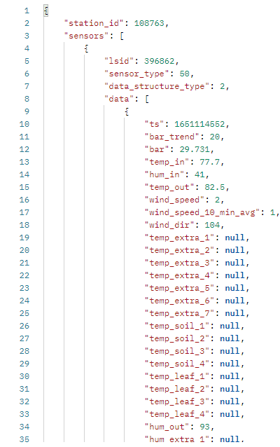
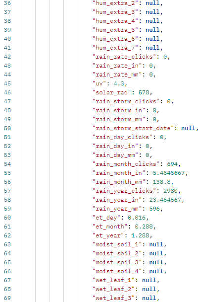

# Historical NUS Davis Weather Station Agent

This agent is for maintaining data and the corresponding instances in the knowledge graph (KG) regarding the NUS Davis weather station. It's only purpose is to retrieve 
new/historical data from excel files and download it into the corresponding database, as well as, instantiating KG instances and connection when called for the first time. 
The agent uses the [time-series client](https://github.com/cambridge-cares/TheWorldAvatar/tree/develop/JPS_BASE_LIB/src/main/java/uk/ac/cam/cares/jps/base/timeseries)
from the JPS_BASE_LIB to interact with both the KG and database.

### Data retrieval and pre-processing
This agent is designed to work with Excel 2007 or later versions. Some pre-processing might be required in order to ensure that the excel files are compatible with the agent.

Firstly, the keys for each column in the excel files must correspond with the keys found in the weather.properties file. The properties file can be found in the mapping folder under the `config` folder.

Secondly, the timestamps in the excel files must be in UTC timezone. The agent will then convert the timestamps to a local date time with offset.

Lastly, the excel file should be named "data" with a xlsx format and the file should be placed in the `config` folder.

This is an example of how the excel file looks like:


#### Example readings
Readings are returned to the response body in form of a JSON Object which consist of key-value pair. The JSONObject has the 
key:"sensors", which contains a JSONArray containing a JSONObject. Inside this JSONObject is a JSONArray associated with the key:"data". This JSONArray contains several JSONObject with one JSONObject per timestamp. The key value pairs within this JSONObject contain all the relevant weather readings corresponding to a particular timestamp. The key for the timestamp is `[ts]`.
The following images are examples of what the JSONObject looks like: 





## Usage 
This part of the README describes the usage of the input agent. The module itself can be packaged into an executable war, deployed as a web servlet on tomcat. Sending the appropriate request to the correct URL will initiate the agent. Since it uses the time-series client which maintains both instances in a knowledge graph and a Postgres database to store the data, these will be required to be set-up before.  

The [next section](#requirements) will explain the requirements to run the agent.

### Requirements
It is required to have access to a knowledge graph SPARQL endpoint and Postgres database. These can run on the same machine or need to be accessible from the host machine via a fixed URL.

This can be either in form of a Docker container or natively running on a machine. It is not in the scope of this README to explain the set-up of a knowledge graph triple store or Postgres database.

### Property files
For running the agent, three property files are required:
- One [property file for the agent](#agent-properties) itself pointing to the mapping configuration.
- One [property file for the time-series client](#time-series-client-properties) defining how to access the database and SPARQL endpoint.
- One [property file for the excel file connector](#excel-connector-properties) defining the number of columns/keys for the data excel file.

#### Agent properties
The agent property file only needs to contain a single line:
```
nusDavisWeatherStation.mappingfolder=NUSDavisWeatherStation_AGENT_MAPPINGS
```
where `NUSDavisWeatherStation_AGENT_MAPPINGS` is the environment variable pointing to the location of a folder containing JSON key to IRI mappings. An example property file can be found in the. An example property file can be found in the `config` folder under 
`agent.properties`. See [this section](#mapping-files) of the README for an explanation of the mapping files.

#### Time-series client properties
The time-series client property file needs to contain all credentials and endpoints to access the SPARQL endpoint of the knowledge graph and the Postgres database. It should contain the following keys:
- `db.url` the [JDBC URL](https://www.postgresql.org/docs/7.4/jdbc-use.html) for the Postgres database
- `db.user` the username to access the Postgres database
- `db.password` the password to access the Postgres database
- `sparql.query.endpoint` the SPARQL endpoint to query the knowledge graph
- `sparql.update.endpoint` the SPARQL endpoint to update the knowledge graph

More information can be found in the example property file `client.properties` in the `config` folder.

#### Excel connector properties
The Excel connector properties contain the number of columns/keys for each of the excel files. It should contain the following keys:
- `numOfKeys` the number of columns/keys in the data excel file.

More information can be found in the example property file `xlsxconnector.properties` in the `config` folder.

#### Mapping files
What are the mapping files and why are they required? The mapping files define how data received from the API is connected
to the knowledge graph (KG). Specifically, each JSON key in the readings (see [Example readings](#example-readings)) 
represents a specific measure that needs to be represented by an IRI, if it should be saved in the database.

Furthermore, measures can be grouped into one time-series (will result in one time-series instance per group in the KG).
This should be done so that all measures in one group are recorded at the same time interval, and so they come from 
the same readings

The mapping is achieved in this package by using one property file per group. Each property file contains one line per 
JSON key that should be linked to an IRI, e.g. like:
```
temp_in=http:/example/temp_in
```
If the IRI is left empty (`temp_in=` in the example), i.e. because there is no instance that represents the measure yet, 
it will be automatically created when the agent is run for the first time. This automatically generated URI will have the
following form:
```
[prefix]/[key]_[UUID]
```
where the `[prefix]` is hardcoded into the `NUSDavisWeatherStationInputAgent` class in a public, static field called `generatedIRIPrefix`
which is based on the time-series client namespace, `[key]` is the JSON key the URI is generated for, and `[UUID]` is a 
randomly generated UUID.

Note, that not all JSON keys need to be represented in the mapping files (the data will simply be ignored and not stored), 
but there needs to be a 1-1 mapping, i.e. no IRI can be used for multiple JSON keys.

To ensure that the same IRIs are used for each JSON key, the mapping files are saved back after each run (only really 
necessary when some of them are automatically generated). Note, that if you change any mapping in preceding runs, they 
will be seen as new time-series, which can result in inconsistencies in both the KG and database. To retrieve the mapping 
files from a running docker container, you have to type in the following into the command line:

```
docker cp <Docker container ID>://root/mappings/<name of properties file> <destination filepath on your machine>
```

For example, to retrieve the weather.properties mapping file from the docker container, the following line have to be entered into the command line:

```
docker cp 7956ce42351d://root/mappings/weather.properties C:\Users\USER01\Desktop\weather.properties
```

Examples for the structure of the mapping folder and files can be found in the `mapping` folder within the `config` 
folder.  (see 
also [Example readings](#example-readings)).

### Building the NUSDavisWeatherStation Agent

The NUSDavisWeatherStation Agent is set up to use the Maven repository at https://maven.pkg.github.com/cambridge-cares/TheWorldAvatar/ (in addition to Maven central). You'll need to provide your credentials in single-word text files located like this:
```
./credentials/
    repo_username.txt
    repo_password.txt
```
repo_username.txt should contain your github username, and repo_password.txt your github [personal access token](https://docs.github.com/en/github/authenticating-to-github/creating-a-personal-access-token),
which must have a 'scope' that [allows you to publish and install packages](https://docs.github.com/en/packages/working-with-a-github-packages-registry/working-with-the-apache-maven-registry#authenticating-to-github-packages).

Modify `xlsxconnector.properties` and `client.properties` in the `config` folder accordingly. You should not modify the `agent.properties` file as the Dockerfile will set the environment variable 
NUSDavisWeatherStation_AGENT_MAPPINGS to point towards the location of the mapping folder. The Dockerfile will copy all 3 properties files and mapping folder and set environment variables pointing 
to their location thus you do not need to shift the properties files and mapping folder nor add in environment variables manually.

To build and start the agent, open up the command prompt in the same directory as this README, run
```
docker-compose up -d
```
Note that for building the agent in the Claudius server the following command should be used
```
DOCKER_BUILDKIT=1 docker build .
```
The agent is reachable at "historical-nusdavis-agent/retrieve" on localhost port 1026.


#### Run the agent
To run the agent, a POST request must be sent to http://localhost:1026/historical-nusdavis-agent/retrieve with a correct JSON Object.
Follow the request shown below.

```
POST http://localhost:1026/historical-nusdavis-agent/retrieve
Content-Type: application/json
{"agentProperties":"HISTORICALDAVIS_AGENTPROPERTIES","connectorProperties":"HISTORICALDAVIS_CONNECTORPROPERTIES","clientProperties":"HISTORICALDAVIS_CLIENTPROPERTIES"}
```
In curl syntax
```
curl -X POST --header "Content-Type: application/json" -d "{\"agentProperties\":\"HISTORICALDAVIS_AGENTPROPERTIES\",\"connectorProperties\":\"HISTORICALDAVIS_CONNECTORPROPERTIES\",\"clientProperties\":\"HISTORICALDAVIS_CLIENTPROPERTIES\"}" localhost:1026/historical-nusdavis-agent/retrieve
```

If the agent runs successfully, you should see a returned JSON Object that is similar to the one shown below.
```
{"Result":["Input agent object initialized.","Time series client object initialized.","XLSX connector object initialized.","Retrieved 5 weather station reading.","Data updated with new readings from API.","Timeseries Data has been updated."]}
```
